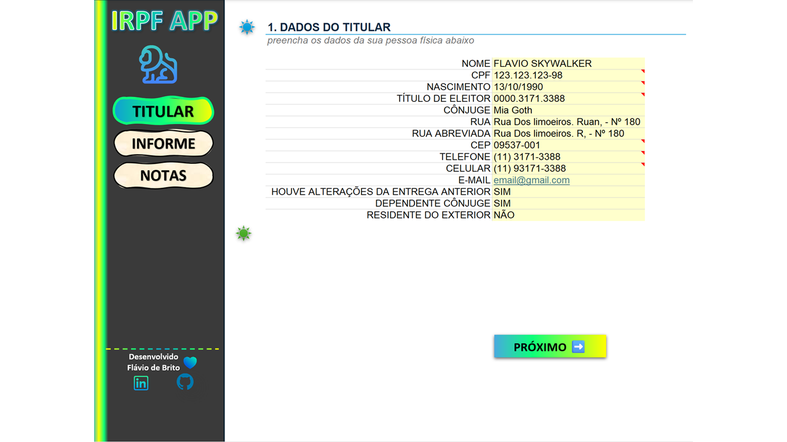
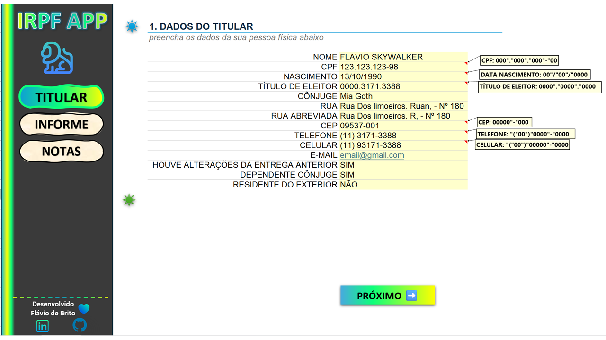
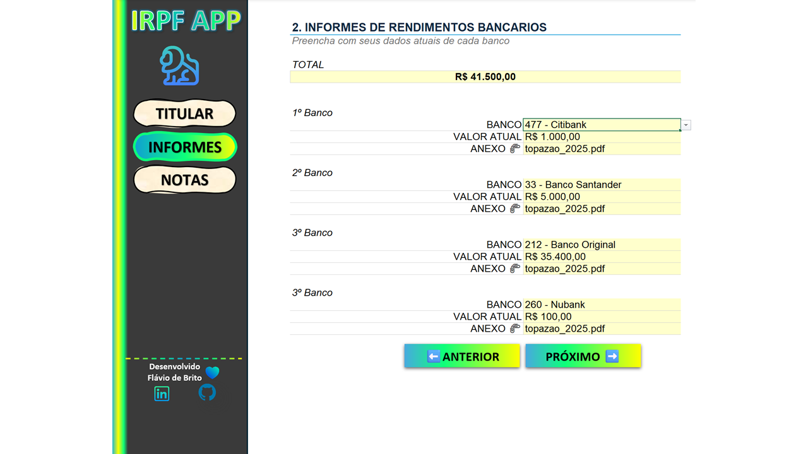
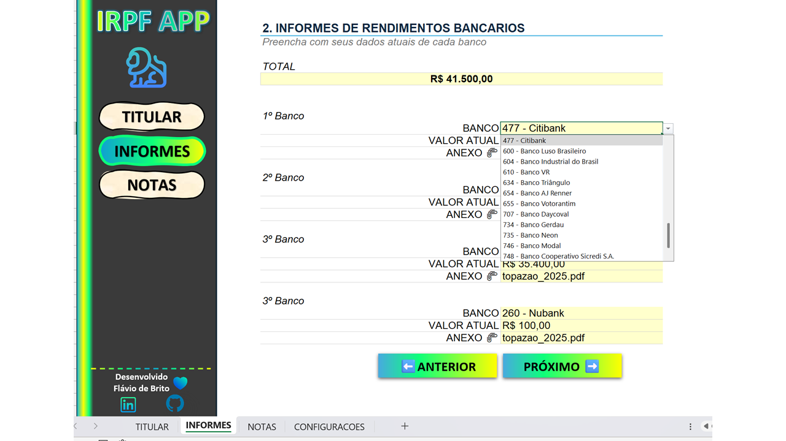
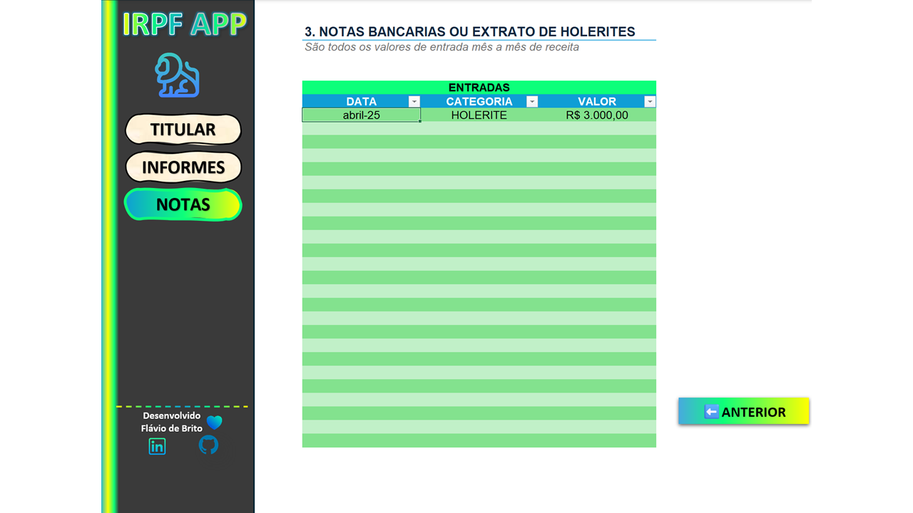
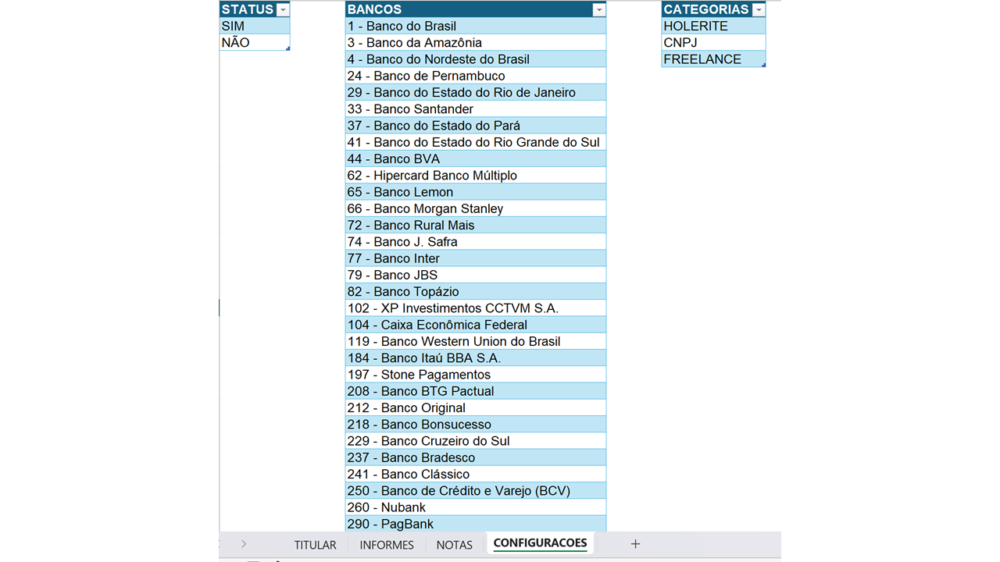

# IRPF APP - Organizador de Declaração de Imposto de Renda


---

## Visão Geral da Aplicação

O **IRPF APP** é uma ferramenta desenvolvida em Microsoft Excel, utilizando macros em VBA (Visual Basic for Applications), para organizar e facilitar a declaração de Imposto de Renda de Pessoa Física (IRPF). A aplicação oferece uma interface amigável e profissional que se assemelha a um aplicativo independente, permitindo que o usuário insira e organize dados de forma intuitiva.

O design foi cuidadosamente planejado para proporcionar uma experiência limpa e imersiva, ocultando elementos padrão do Excel, como linhas de grade, barra de fórmulas e cabeçalhos. O resultado é uma planilha funcional que impressiona tanto pelo apelo visual quanto pela praticidade.

---

## Índice

- [Visão Geral da Aplicação](#visão-geral-da-aplicação)
- [Funcionalidades Principais](#funcionalidades-principais)
- [Como Utilizar](#como-utilizar)
  - [1. Guia Titular](#1-guia-titular)
  - [2. Guia Informes](#2-guia-informes)
  - [3. Guia Notas](#3-guia-notas)
- [Detalhes Técnicos e Customização (VBA)](#detalhes-técnicos-e-customização-vba)
  - [Macro 1: Alinhamento Preciso de Objetos](#macro-1-alinhamento-preciso-de-objetos)
  - [Macro 2: Configuração da Visualização](#macro-2-configuração-da-visualização)
- [Créditos](#créditos)

---

## Funcionalidades Principais

### Interface Intuitiva
A interface foi projetada para ser simples e direta, com navegação facilitada por botões interativos e menus laterais. O design minimiza distrações, criando uma experiência semelhante a um aplicativo nativo.

### Navegação Facilitada
O menu lateral permite navegar entre as guias principais:
- **TITULAR**: Dados pessoais do declarante.
- **INFORMES**: Informes de rendimentos bancários.
- **NOTAS**: Registro de receitas mensais.

Botões "PRÓXIMO" e "ANTERIOR" também estão disponíveis para navegação sequencial.

### Validação de Dados
Campos críticos, como CPF, CEP, números de telefone e lista de bancos, utilizam validação de dados para evitar erros de preenchimento. Mensagens de alerta orientam o usuário durante o processo.

### Máscaras de Formatação
Os campos de CPF, CEP e números de telefone são formatados automaticamente ao serem digitados, dispensando a necessidade de inserir pontos, traços ou parênteses manualmente.

### Proteção de Planilha
Apenas células destinadas à entrada de dados estão desbloqueadas. O restante da planilha é protegido para evitar alterações acidentais em fórmulas, títulos ou elementos de design.

---

## Como Utilizar

### 1. Guia Titular

Esta é a primeira tela, onde você insere suas informações pessoais:

- **Preencha os campos**: Insira seu Nome, CPF, Data de Nascimento, Título de Eleitor, Cônjuge, Endereço, etc.
- **Formatação Automática**: Ao digitar seu CPF, CEP ou telefone, o Excel aplicará a formatação correta automaticamente.
- **Respostas Sim/Não**: Para perguntas como "Houve alterações da entrega anterior", escolha "Sim" ou "Não" na lista suspensa.

Exemplo de máscara de formatação:
```
CPF: 123.123.123-98
CEP: 09537-001
Telefone: (11) 3171-3388
```

### 2. Guia Informes

Utilize esta guia para declarar os valores que você possui em diferentes contas bancárias:

- **Selecione o Banco**: No campo "BANCO", escolha um banco da lista suspensa.
- **Informe o Valor**: Digite o valor atual que você possui na conta.
- **Anexo**: No campo "ANEXO", insira o nome do arquivo digital (ex.: `informe_banco_2025.pdf`) que será enviado ao contador.
- **Totalizador**: O campo "TOTAL" no topo da tela somará automaticamente os valores de todas as contas bancárias listadas.

### 3. Guia Notas

Registre todas as suas receitas mensais nesta guia:

- **Insira a Data**: Adicione a data do recebimento. É possível formatar este campo para exibir apenas o mês e o ano.
- **Escolha a Categoria**: Selecione a origem da receita na lista (ex.: HOLERITE, CNPJ, FREELANCE).
- **Digite o Valor**: Insira o valor recebido, que será formatado como moeda.
- **Expansão Automática**: A tabela se expande conforme novas entradas são adicionadas.

---

## Detalhes Técnicos e Customização (VBA)

### Macro 1: Alinhamento Preciso de Objetos

O Excel não possui uma função nativa para definir a posição X e Y de um objeto, o que dificulta o alinhamento perfeito de ícones e botões ao duplicar guias. Esta macro resolve o problema ao posicionar um objeto nomeado em coordenadas exatas.

```vba
Sub AlinharObjeto()
'----------------------------------------------------------------
'DESCRIÇÃO: 
'Esta macro serve para alinhar um objeto específico (como uma imagem ou forma) 
'em uma posição X e Y exata na planilha ativa. 
'É útil para manter a consistência visual entre múltiplas guias. 
' 
'COMO USAR: 
'1. Dê um nome ao seu objeto no Painel de Seleção. 
'2. Altere o valor da variável "NomeDoObjeto" para o nome que você definiu. 
'3. Defina os valores de "PosicaoX" e "PosicaoY". 
'4. Execute a macro na guia onde o objeto precisa ser alinhado. 
'----------------------------------------------------------------
'--- VARIÁVEIS ---
Dim NomeDoObjeto As String  
Dim PosicaoX As Double  
Dim PosicaoY As Double  
'-----------------

'--- CONFIGURAÇÕES ---
'Altere o nome do objeto e as posições X e Y conforme necessário  
NomeDoObjeto = "Icon_LinkedIn" '< Altere para o nome do seu objeto  
PosicaoX = 70 'Posição a partir da esquerda  
PosicaoY = 300 'Posição a partir do topo  
'---------------------

'Verifica se o objeto existe na planilha ativa e o posiciona  
On Error Resume Next  
With ActiveSheet.Shapes(NomeDoObjeto)  
    .Left = PosicaoX  
    .Top = PosicaoY  
End With  
On Error GoTo 0
End Sub
```

### Macro 2: Configuração da Visualização

Para criar a experiência de "aplicativo", duas macros são usadas: uma para entrar no modo de visualização limpo e outra para restaurar a visualização padrão do Excel.

```vba
Sub ConfigurarVisualizacaoApp()
'Oculta elementos da interface do Excel para uma aparência de aplicativo
Application.DisplayFormulaBar = False 'Oculta a barra de fórmulas
ActiveWindow.DisplayHeadings = False 'Oculta os cabeçalhos de linha/coluna
ActiveWindow.DisplayGridlines = False 'Oculta as linhas de grade
Application.DisplayFullScreen = True 'Ativa o modo de tela cheia
End Sub

Sub RestaurarVisualizacaoPadrao()
'Restaura a visualização padrão do Excel
Application.DisplayFormulaBar = True
ActiveWindow.DisplayHeadings = True
ActiveWindow.DisplayGridlines = True
Application.DisplayFullScreen = False
End Sub
```

---

## Créditos

Este projeto foi desenvolvido e idealizado por **Flávio de Brito**. O conteúdo e a metodologia foram baseados nas aulas e materiais fornecidos pela DIO.

---

<p align="center">
  
</p>

<p align="center">
  
</p>

<p align="center">
  
</p>

<p align="center">
  
</p>

<p align="center">
  
</p>

<p align="center">
  
</p>


*Imagem ilustrativa da interface principal do IRPF APP.*

---

<div style="display: flex; justify-content: center; gap: 10px; flex-wrap: wrap;">
  
  
  
  
  
  
</div>


*Imagens complementares do projeto.*
---

> **Observação**: Este README.md foi formatado para uso em repositórios GitHub. Certifique-se de incluir as imagens relevantes no diretório do projeto para que elas sejam exibidas corretamente.